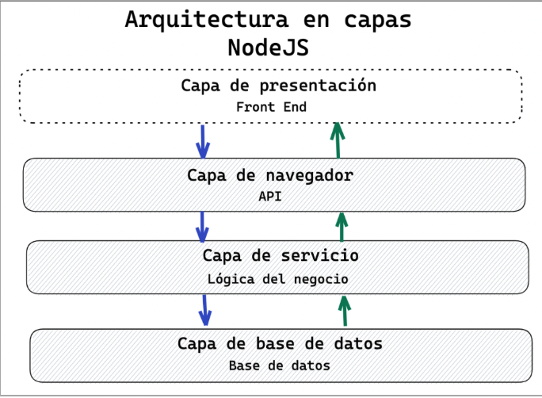

# Aruitectura en capas

* Es un patrón que se utiliza en desarrollo de software donde los roles y responsabilidades dentro de la aplicación (app) son separadas en capas.
* Uno de sus objetivos es separar responsabilidades entre componentes.
* Otro objetivo es organizar las capas para que ellas lleven a cabo su labor específica dentro del app.
* Una app pequeña suele contener 3 capas. Luego, el número de capas puede ir aumentando con la complejización de la app.

1. **Capa de ruteo (API endpoint):** maneja la interfaz de programación de aplicaciones (API). Su único trabajo es recibir las peticiones del cliente, delegar la tarea de computar la respuesta, y una vez obtenido el resultado retornarlo como respuesta al cliente. En otras palabeas, expone los endpoints

2. **Capa de servicio o contrlador:** maneja la lógica de negocios del app. Significa que los datos son transformados o calculados para cumplir con los requerimientos del cliente. Accede a los datos (leer-guardar) sólo a través de la capa de persistencia.

3. **Capa de persistencia:** tiene acceso a la base de datos para crear, editar, o borrar datos. Preferentemente, aquí no debemos encontrar lógica de negocio, sino mecanismos relacionados con la infraestructura del servidor.

## Flow between layers

1. La travesía de los datos comienza en la capa de presentación donde el usuario hace click y llama a la función que envía la solicitud de datos a la API, representada en nuestro sistema por la capa de ruteo. 
2. El componente en la capa de ruteo llama al componente en la capa de servicio, y se encarga de esperar por la respuesta de la capa de servicio para así retornarlo.
3. Los datos son transformados o calculados en la capa de servicio antes de devolver una respuesta (o de pasarlos a la siguiente capa).
4. En este último caso, el componente en la capa de servicios llama al componente inyectado de la capa de persistencia y le pasa los datos.
5. Finalmente, se lleva a cabo la solicitud de datos al servidor de base de datos en la capa de persistencia. A esta capa se accede mediante llamados asincrónicos (preferentemente utilizando promesas).
6. Cuando el llamado a la capa de persistencia se resuelve con la respuesta del servidor de base de datos, la respuesta retorna a la capa de servicio. Esta retorna a la capa de rutas. Cuando la respuesta alcanza la capa de rutas, los datos llegan al usuario a través de la capa de presentación.
7. Debemos tener en cuenta que este siempre es el camino, los datos, solicitudes y respuestas no saltean capas.

## Implementation

Como ya mencionamos, es muy importante separar responsabilidades entre componentes. Para nuestra separación utilizaremos 5 componentes:
1. Server: inicializa la aplicación, y carga los routers correspondientes.
2. Router: que contiene los métodos disponibles para cada recurso de la aplicación, y sendas mediante las cuales se los accede.
3. Controller: contiene las funciones que resolverán cada petición que llegue a cada una de las rutas definidas.
4. Service: contiene las funciones con la lógica de negocio relacionada a los recursos del sistema.
5. Data Access Object (DAO): contiene las funciones relacionadas con el acceso a la base de datos.

* Server es la cara visible de nuestro servidor, la interfaz entre el Cliente y la capa de ruteo del servidor.
* Los componentes de ruteo representan la Capa de Ruteo, y son los únicos en donde encontraremos referencias a la naturaleza de cliente-servidor de nuestro sistema (por ejemplo: referencias a la librería Express).
* Los controladores constituyen la interfaz entre la capa de ruteo y la capa de negocios.
* Los componentes de servicios representa nuestra Capa de Negocios. Aquí se realizan todas las validaciones y se toman todas las decisiones para cuidar que se cumplan las reglas del negocio que se está modelando. Estos componentes generalmente no contienen referencias a tecnologías específicas ni frameworks utilizados, únicamente javascript puro.
* Los DAOs (data access objects: objetos de acceso a datos) constituyen la Capa de Persistencia, y son los únicos lugares en donde encontraremos referencias al almacenamiento de datos (ejemplo: referencias a la librería Mongoose, o Firebase, etc).

Let's create a folder per each layer:
